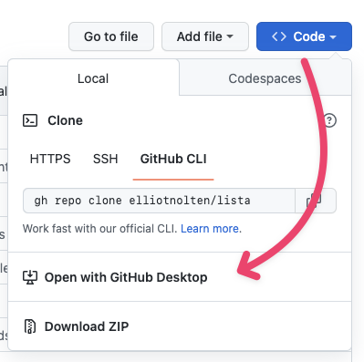
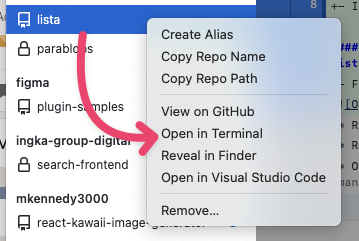

# LISTA Figma plugin
Populate your designs with real IKEA product data!
> We found that external colleagues (who don't have an IKEA laptop) are not able to install and run the plugin locally.

## Installation and build (20 to 30 minutes)
### 1. Install software
* [Node.js](https://nodejs.org/en/). ⚠️ install the `recommended` version
* [Github Desktop](https://docs.github.com/en/desktop/installing-and-configuring-github-desktop/installing-and-authenticating-to-github-desktop/installing-github-desktop)
* If you don't have it already create a [Github account](https://github.com/signup).
  > You can set up an account with either your personal or IKEA email.

### 2. Checkout the `master` branch on [elliotnolten/lista](https://github.com/elliotnolten/lista)
* From dropdown `Code` choose `Open with Github Desktop`


### 3. Build the plugin
To build the plugin locally on your computer a couple of command lines need be typed. Don't be discouraged though, I'll guide you step-by-step. And it comes down to copy/past 😎
* If [Step 2](#2-checkout-the-master-branch-on-elliotnoltenlistahttpsgithubcomelliotnoltenlista) was successful you should see `lista` in the Github Desktop app.
* Select it, `right-click` `lista` and choose `Open in Terminal`

* Type `sudo corepack enable` and hit `Enter`, this enables the next steps
  > This will also ask for your system password (the same you use to log in into your computer).
  
  > And this will install `Command Line Tools`, which are required. This installation will take about **20 minutes**.

* Type `yarn` and hit `Enter` to install dependencies.
* Type `yarn build:watch` and hit `Enter` to start webpack in watch mode.
* Open `Figma` -> `Plugins` -> `Development` -> `Import plugin from manifest...` and choose `manifest.json` file from this repo.

---

## How to use it
1. Go to `Plugins` -> `Development` -> `Lista`.
2. Select your component instances you want to poplulate with IKEA data. Make sure your layers have the correct naming, see [Output and naming layers](#output-and-naming-layers).
3. Fill in your search query and hit `Submit`.
4. See that all your text layers and frames with background images are populated with real data 🪄

---

## Data
This plugin fetches data from the [SIK API](https://sik-debug-dot-ikea-search-data.ew.r.appspot.com/index.html).
This API retrieves product data based on a search query that reflects the actual result that you see on an IKEA [search result page](https://www.ikea.com/nl/en/search/products/?q=billy).

### Input
This API can take several parameters to make the API response to fit your needs.

However the LISTA Figma plugin makes some assumptions on what we currently need as a design team and has default values for the following parameters.

**Default values**
| Key | Description |Type | Value |
| ----------- | ----------- | ----------- | ----------- |
| language | This affects the language of all the data. | `String` | "gb/en/" |
| zip | This shows home delivery statuses. | `String` | "RM20 3WJ" |
| store | This show store stock statuses. | `String` | "262" / "Lakeside" |
| types | The API can also output "CONTENT", "STORE", etc. | `String` | "PRODUCT" |

**Variables**
| Key | Description | Type | Default value |
| ----------- | ----------- | ----------- | ----------- |
| q | The search query | `String` | "" |
| size | Amount of items that need to be fetched. This number corresponds to the amount of selected component instances on your canvas. | `Number` | 0 |

### Output and naming layers
To make sure your text layers are populated with the correct texts and the Frames are filled with the correct images, you need to give your layers the same name as the corresponding properties from the json object prefixed with a `#`.


Check out this [API response example](https://sik.search.blue.cdtapps.com/nl/en/search-result-page?q=billy&types=PRODUCT) to see what other pieces of information you can add to your design.

```json
{
  "itemNo": "00263850",
  "itemType": "ART",
  "price": {
    "prefix": "€ ",
    "wholeNumber": "44",
    "separator": ".",
    "decimals": "99",
    "suffix": "",
    "isRegularCurrency": false
  },
  "contextualImageUrl": "https://www.ikea.com/nl/en/images/products/billy-bookcase-white__1051924_pe845813_s5.jpg",
  "mainImageAlt": "BILLY Bookcase, white, 80x28x202 cm",
  "breathTaking": false,
  "discount": "",
  "name": "BILLY",
  "typeName": "Bookcase",
  "itemMeasureReferenceText": "80x28x202 cm",
  "productDescription": "Bookcase, 80x28x202 cm",
  "mainImageUrl": "https://www.ikea.com/nl/en/images/products/billy-bookcase-white__0625599_pe692385_s5.jpg",
  "pipUrl": "https://www.ikea.com/nl/en/p/billy-bookcase-white-00263850/",
  "id": "00263850",
  "itemNoGlobal": "00263850",
  "onlineSellable": true,
  "lastChance": false,
  "gprDescription": {},
  "colors": [],
  "priceNumeral": 44.99,
  "currencyCode": "EUR",
  "tag": "NONE",
  "quickFacts": [],
  "features": [],
  "homeDelivery": {
    "text": "Available for delivery",
    "status": "HIGH_IN_STOCK"
  },
  "cashAndCarry": {
    "text": "In stock at Lakeside",
    "status": "HIGH_IN_STOCK"
  },
  "badge": {
    "type": "TOP_SELLER",
    "text": "Best seller"
  }
}
```

---

## Toolings
This repo is using:
* React + Webpack
* TypeScript
* Prettier precommit hook
